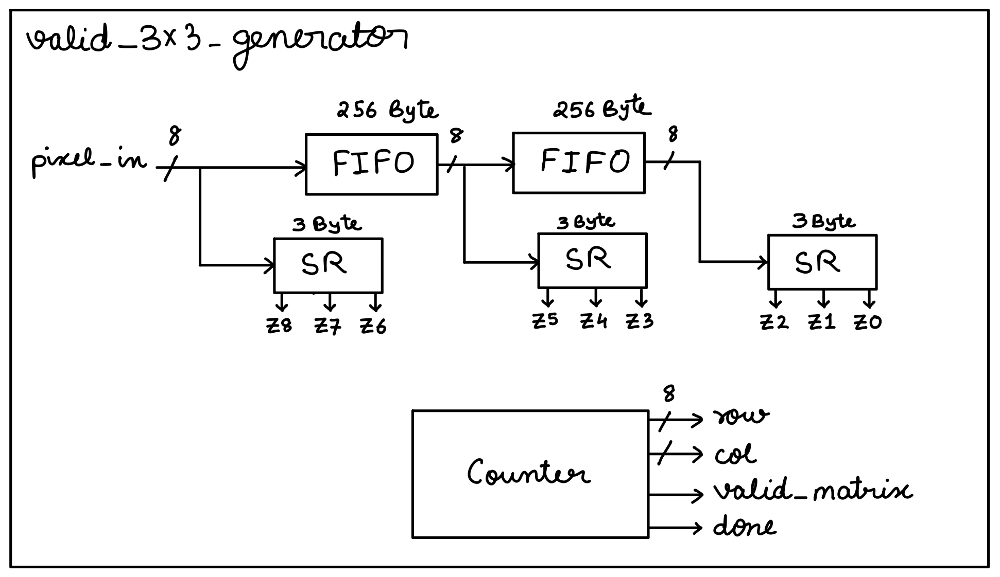
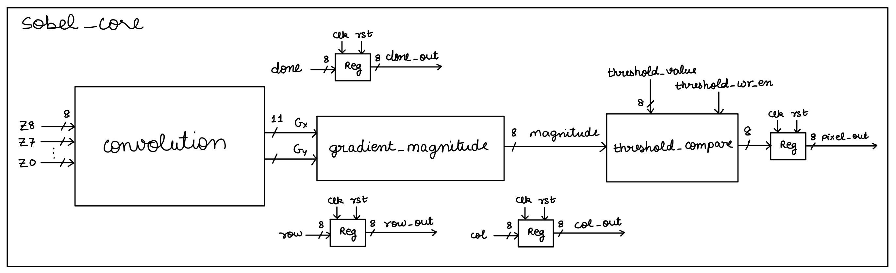
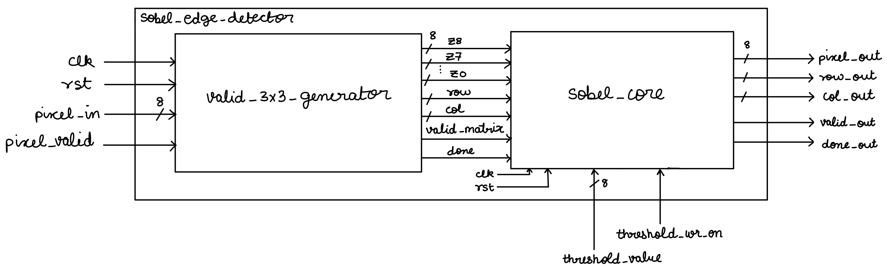
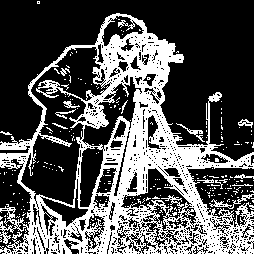

# Sobel Edge Detector - Group 48

## Overview

This project implements a hardware Sobel edge detector that processes 256×256 grayscale images at 250 MHz. The design uses the L1 norm (|Gx| + |Gy|) instead of the more expensive L2 norm for gradient magnitude calculation.

## How It Works

The Sobel edge detector operates by convolving the input image with two 3×3 kernels:
- **Gx**: Horizontal gradient kernel
- **Gy**: Vertical gradient kernel

The gradient magnitude is computed as |Gx| + |Gy|, then compared against a configurable threshold to produce a binary output (0 or 255).

## Architecture

The design consists of two main blocks:

### 1. Valid 3×3 Generator
Continuously streams pixels and produces valid 3×3 windows for each convolution operation.

### 2. Sobel Core
Performs convolution with Sobel kernels, computes gradient magnitude, applies threshold, and generates output pixels.

### Top-Level Architecture

## Results

### Input Image

### Output Images at Different Thresholds

The edge detection threshold can be configured to control sensitivity. Below are the results at different threshold values:

| Threshold = 64 | Threshold = 128 | Threshold = 192 |
|----------------|-----------------|-----------------|
|  |  |  |

- **Lower threshold (64)**: More edges detected, including noise
- **Medium threshold (128)**: Balanced edge detection
- **Higher threshold (192)**: Only strong edges detected

## Key Features

- **Clock Frequency**: 250 MHz
- **Image Size**: 256×256 pixels
- **Configurable Threshold**: Fully adjustable edge detection sensitivity
- **Binary Output**: 0 (no edge) or 255 (edge detected)
- **Automatic Clipping**: Min/max gradient magnitude clipping

## Performance Metrics

- **Setup Slack**: 0.663 ns
- **Hold Slack**: 0.015 ns
- **Design Area**: 51,908.40 μm²
- **Total Power**: 23.15 mW
  - Sequential: 18.84 mW
  - Combinational: 1.85 mW
  - Leakage: 1.46 mW

## Project Structure

- `Verilog/`: RTL design files
- `Synthesis/`: Synthesis scripts and reports
- `Physical_Design/`: Place and route files
- `Physical_Verification/`: DRC, antenna, and connectivity checks
- `Images/`: Input images in hex and PNG formats
- `Scripts/`: Utility scripts (hex to image conversion)

## Key Signals

- **pixel_valid**: Input pixels are shifted in when high
- **done**: Asserted when all 256×256 pixels are processed
- **threshold_value** & **threshold_wr_en**: Update the threshold value
- **row_out** & **col_out**: Output pixel coordinates
- **valid_out**: Indicates when output pixel is valid

## Running the Design

See the `Scripts/` folder for simulation and conversion utilities. The testbench reads input images from `Images/hex/` and generates `output.hex`, which can be converted to PNG using the provided Python script.
